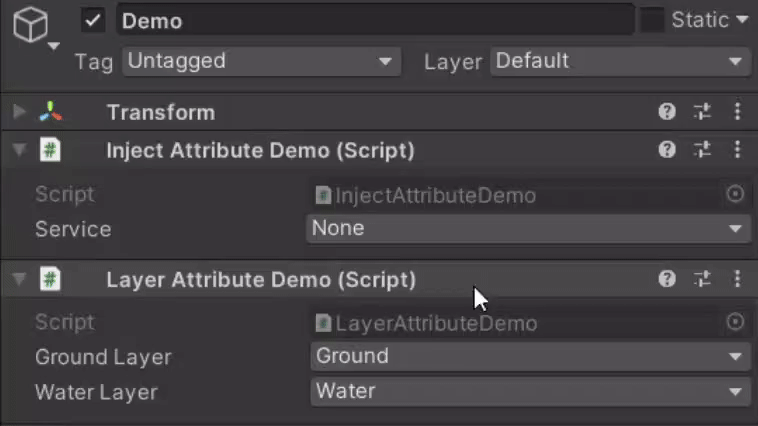
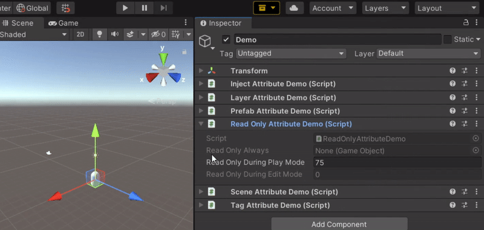
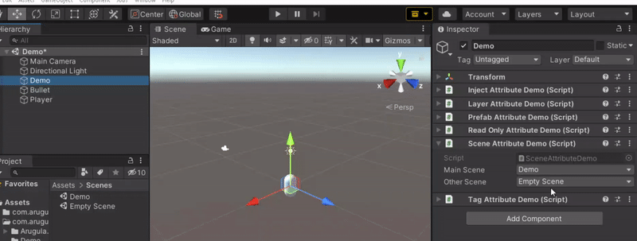
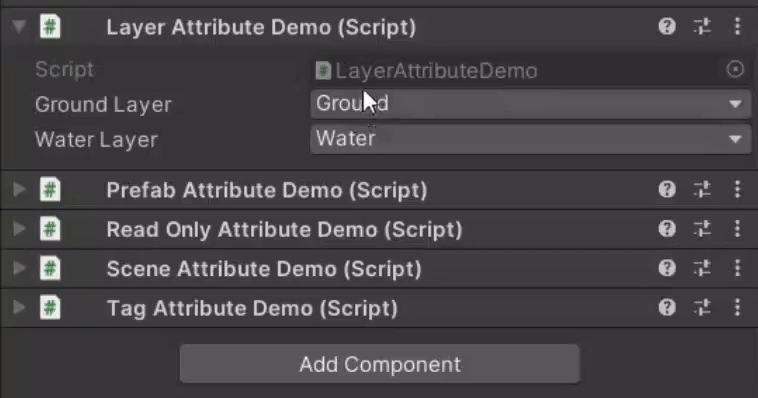
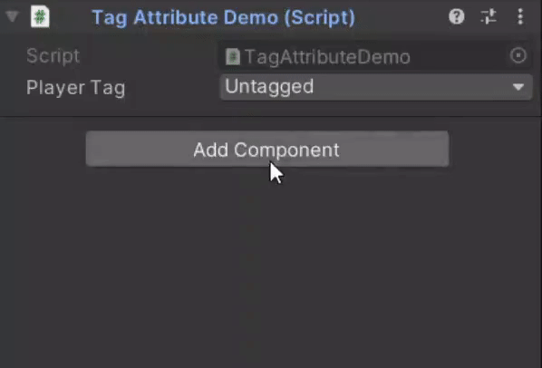
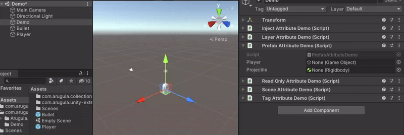

# Unity Attributes
Provides custom attributes to work with the Unity game engine.

## Installing
You can install this package through the Unity Package Manager using the git url.

`https://github.com/LordArugula/Unity-Extensions.git`

## Attributes

### [InjectAttribute]
Allows injecting dependencies via the Inspector to fields decorated with the [SerializeReference](https://docs.unity3d.com/Documentation/ScriptReference/SerializeReference.html) attribute.

```cs
using Arugula.Extensions;

public interface IService { }

public class FooService : IService { }

public class BarService : IService { }

public class InjectAttributeDemo : MonoBehaviour
{
    [Inject]
    [SerializeReference]
    public IService service;
}
```



### [ReadOnlyAttribute]
Prevents editing fields via the Inspector during Play Mode, Edit Mode, or both.

```cs
using Arugula.Extensions;

public class ReadOnlyAttributeDemo : MonoBehaviour
{
    [ReadOnly]
    public GameObject readOnlyAlways;

    [ReadOnly(playMode: true)]
    public int readOnlyDuringPlayMode;
    
    [ReadOnly(editMode: true)]
    public float readOnlyDuringEditMode;
}
```



### [SceneAttribute]
Makes integer or string fields a scene selection field.

```cs
using Arugula.Extensions;

public class SceneAttributeDemo : MonoBehaviour
{
    [Scene]
    public int mainScene;

    [Scene]
    public string otherScene;
}
```



### [LayerAttribute]
Makes integer or string fields a layer selection field.

```cs
using Arugula.Extensions;

public class LayerAttributeDemo : MonoBehaviour
{
    [Layer]
    public int groundLayer;

    [Layer]
    public string waterLayer;
}
```



### [TagAttribute]
Makes string fields a tag selection field.

```cs
using Arugula.Extensions;

public class TagAttributeDemo : MonoBehaviour
{
    [Tag]
    public string playerTag;
}
```



### [PrefabAttribute]
Restricts a GameObject or Component field to only accept prefab assets.

```cs
using Arugula.Extensions;

public class PrefabAttributeDemo : MonoBehaviour
{
    [Prefab]
    public GameObject player;

    [Prefab]
    public Rigidbody projectile;
}
```



## Reference Attributes
These attributes help stop you from leaving a reference field unassigned. 
The RequireReference attribut forces you to assign the field before entering Play Mode.
The others are named similarly to some of Unity's api. Those automatically assign a reference to an object or simply leaving a warning in the Console Window if they are not able to find anything. References ge-t assigned whenever Unity reloads, the Hierarchy changes, or an asset is imported.

### [RequireReferenceAttribute]
Forces a reference type field to be assigned before entering Play Mode.

```cs
using Arugula.Extensions;

public class RequireReferenceAttributeDemo : MonoBehaviour
{
    [RequireReference]
    public Animator animator;

    [RequireReference]
    public GameObject prefab;

    [RequireReference, SerializeReference, Inject]
    public IService list;
}
```

### [FindGameObjectAttribute]
Searches for a GameObject in the scene and assigns it.

```cs
using Arugula.Extensions;

public class FindGameObjectAttributeDemo : MonoBehaviour
{
    [FindGameObject(Tag = "Player")]
    public GameObject player;

    [FindGameObject(Name = "MainCamera")]
    public Camera mainCamera;

    [FindGameObject(CreateInstance = true)]
    public GameManager gameManager;
}
```

### [FindAssetAttribute]
Searches for an asset and assigns it.

```cs
using Arugula.Extensions;

public class FindAssetAttributeDemo : MonoBehaviour
{
    [FindAsset(Name = "Player")]
    public GameObject player;

    [FindAsset(Name = "Bullet", CreateAsset = true)]
    public Rigidbody bullet;

    [FindAsset]
    public GameManager prefab;

    [FindAsset(CreateAsset = true)]
    public SomeScriptableObject scriptableObject;
}

```

### [GetComponentAttribute]
Gets the a Component on the GameObject or its children and assigns it.

```cs
public class GetComponentAttributeDemo : MonoBehaviour
{
    [GetComponent(AddComponent = true)]
    public Rigidbody _rigidbody;

    [GetComponent(IncludeChildren = true)]
    public Animator _animator;
}
```
